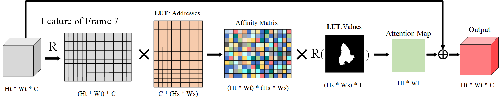

[[Paper]](https://arxiv.org/abs/2008.02745) [[Code]](https://github.com/researchmm/TracKit)

- **Highlight**
    - The runner-up of both VOT2020-ST and VOT2020-RT. 
    - Its variants take the 2nd/3rd/5th places in VOT2020-RT. 

